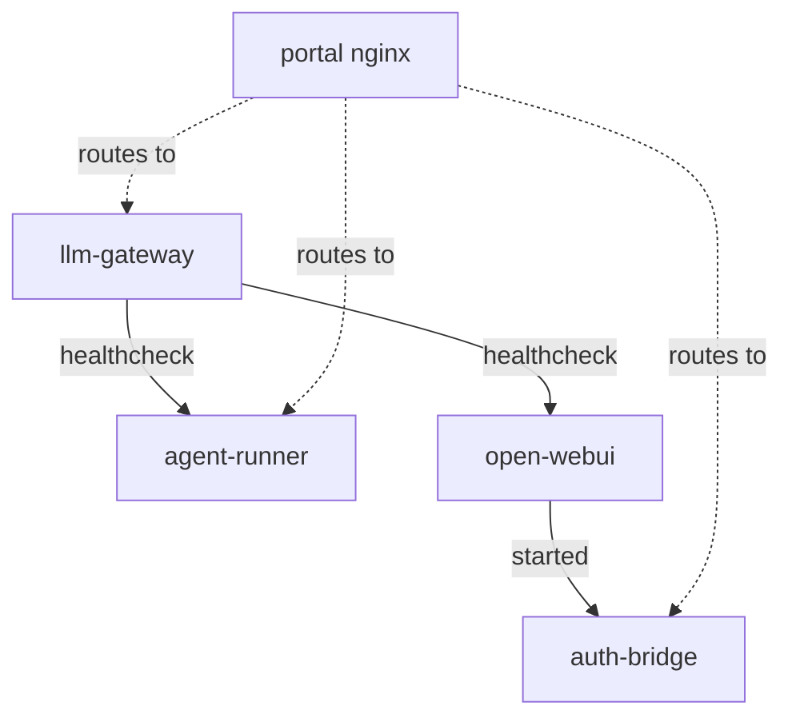

# LLM Studio — Hedgefund Portal Integration Guide

This document specifies how to integrate the LLM Studio into the existing
Frao Technologies hedgefund portal at `~/prhyme/projects/hedgefund`.

---

## Table of Contents

1. [Architecture Overview](#1-architecture-overview)
2. [Mode Selection](#2-mode-selection)
3. [Integration: docker-compose.yml](#3-integration-docker-composeyml)
4. [Integration: nginx.conf](#4-integration-nginxconf)
5. [Integration: Portal state.ts](#5-integration-portal-statets)
6. [Environment Variables](#6-environment-variables)
7. [Volume Mounts](#7-volume-mounts)
8. [Dual-Mode Operation](#8-dual-mode-operation)
9. [Service Dependencies & Startup Order](#9-service-dependencies--startup-order)
10. [Troubleshooting](#10-troubleshooting)

---

## 1. Architecture Overview

```
┌──────────────────────────────────────────────────────────────────┐
│  hedgefund docker-compose.yml                                     │
│                                                                  │
│  ┌──────────┐  ┌──────────┐  ┌──────────┐  ┌──────────────────┐ │
│  │ Portal   │  │ Trading  │  │ Aether   │  │ LLM Studio       │ │
│  │ (nginx)  │  │ Platform │  │ flow     │  │ (this project)   │ │
│  └────┬─────┘  └──────────┘  └──────────┘  └──────────────────┘ │
│       │                                                          │
│       │  trading-network (shared)                                │
│       └──────────────────────────────────────────────────────────┘
```

The LLM Studio services are designed to join the existing `trading-network`
Docker network. The portal's nginx reverse-proxies requests to the LLM Studio
services via service DNS names (`llm-gateway:3100`, `agent-runner:3200`).

---

## 2. Mode Selection

The LLM Studio supports two modes. Choose based on whether you want it
bundled into the main hedgefund compose or running as a standalone stack.

| Mode | Compose File | Network | Use Case |
|------|-------------|---------|----------|
| **Standalone** | `docker-compose.yml` | Creates `llm-studio-network` | Development, testing |
| **Orchestrated** | `docker-compose.hedgefund.yml` | Joins `trading-network` | Production integration |

### Mode Decision Matrix

| Criterion | Standalone | Orchestrated |
|-----------|:----------:|:------------:|
| Port exposure | Direct (3100, 3200, 3300, 3000) | Via nginx on port 80 |
| Auth integration | Separate (Open WebUI built-in) | SSO via portal JWT |
| Network | Isolated bridge | Shares with all services |
| Data isolation | Separate volumes | Named volumes from parent |
| Startup | Independent | Part of full stack start |
| Debugging | Easier (focused logs) | Harder (noisy env) |

---

## 3. Integration: docker-compose.yml

### 3.1 Copy the LLM Studio Services Block

Add the following services to the hedgefund `docker-compose.yml`.
These are designed to match the existing style (BIND_IP, network, env vars).

#### llm-gateway

```yaml
  # ── llm-gateway: Local LLM Model Lifecycle Manager ──
  llm-gateway:
    build:
      context: ./code/llm-gateway
      dockerfile: Dockerfile
    ports:
      - "${BIND_IP:-0.0.0.0}:3100:3100"
    environment:
      GATEWAY_PORT: "3100"
      BIND_IP: "0.0.0.0"
      MODELS_DIR: "/models"
      DATA_DIR: "/data"
      LLAMACPP_BIN: "llama-server"
      DEFAULT_MODEL: "${DEFAULT_MODEL:-}"
      MODEL_CONTEXT_SIZE: "${MODEL_CONTEXT_SIZE:-8192}"
      MODEL_THREADS: "${MODEL_THREADS:-4}"
      # Remote provider API keys (reuse existing Dexter env vars)
      DEEPSEEK_API_KEY: "${DEXTER_DEEPSEEK_API_KEY:-}"
      GEMINI_API_KEY: "${DEXTER_GOOGLE_API_KEY:-}"
      OPENAI_API_KEY: "${DEXTER_OPENAI_API_KEY:-}"
      ANTHROPIC_API_KEY: "${DEXTER_ANTHROPIC_API_KEY:-}"
      OPENROUTER_API_KEY: "${DEXTER_OPENROUTER_API_KEY:-}"
      XAI_API_KEY: "${DEXTER_XAI_API_KEY:-}"
    volumes:
      # GGUF model files (read-only)
      - "${LLAMA_MODELS_DIR:-~/.local/share/llama-lab/models}:/models:ro"
      # Persistent data
      - llm-studio-config:/data/config
      - llm-studio-logs:/data/logs
      # llama.cpp binary from host
      - "${LLAMACPP_BIN_DIR:-/usr/local/bin}:/usr/local/bin:ro"
    networks:
      - trading-network
    restart: unless-stopped
    healthcheck:
      test: ["CMD", "wget", "-qO-", "http://localhost:3100/health"]
      interval: 30s
      timeout: 5s
      retries: 3
      start_period: 10s
```

#### agent-runner

```yaml
  # ── agent-runner: Ephemeral Agent Container Manager ──
  agent-runner:
    build:
      context: ./code/agent-runner
      dockerfile: Dockerfile
    ports:
      - "${BIND_IP:-0.0.0.0}:3200:3200"
    environment:
      RUNNER_PORT: "3200"
      LLM_GATEWAY_URL: "http://llm-gateway:3100"
      DATA_DIR: "/data"
      DEFAULT_MODEL: "${DEFAULT_MODEL:-qwen25-coder-7b}"
      DEFAULT_AGENT_TYPE: "${DEFAULT_AGENT_TYPE:-picoclaw}"
      AGENT_TIMEOUT: "${AGENT_TIMEOUT:-86400}"
      AGENT_CPU_LIMIT: "${AGENT_CPU_LIMIT:-4}"
      AGENT_MEMORY_LIMIT: "${AGENT_MEMORY_LIMIT:-4G}"
    volumes:
      - /var/run/docker.sock:/var/run/docker.sock:rw
      - llm-studio-workspaces:/data/workspaces
      - llm-studio-sessions:/data/sessions
      - llm-studio-config:/data/config:ro
      - llm-studio-logs:/data/logs
    networks:
      - trading-network
    restart: unless-stopped
    depends_on:
      llm-gateway:
        condition: service_healthy
    healthcheck:
      test: ["CMD", "wget", "-qO-", "http://localhost:3200/health"]
      interval: 30s
      timeout: 5s
      retries: 3
      start_period: 10s
```

#### auth-bridge (optional — required for SSO with portal)

```yaml
  # ── auth-bridge: SSO Proxy for Open WebUI ──
  auth-bridge:
    build:
      context: ./code/auth-bridge
      dockerfile: Dockerfile
    ports:
      - "${BIND_IP:-0.0.0.0}:3300:3300"
    environment:
      BRIDGE_PORT: "3300"
      JWT_SECRET: "${JWT_SECRET:-change-me-in-production}"
      OPEN_WEBUI_URL: "http://open-webui:8080"
      OPEN_WEBUI_ADMIN_KEY: "${WEBUI_ADMIN_KEY:-}"
    networks:
      - trading-network
    restart: unless-stopped
    depends_on:
      open-webui:
        condition: service_started
```

#### open-webui (the chat frontend)

```yaml
  # ── open-webui: LLM Studio Chat Frontend ──
  open-webui:
    image: ghcr.io/open-webui/open-webui:main
    expose:
      - "8080"      # Internal only — accessed via auth-bridge or nginx
    environment:
      - OPENAI_API_BASE_URL=http://llm-gateway:3100/v1
      - WEBUI_AUTH_TRUST_HEADERS=true
      - WEBUI_SECRET_KEY=${WEBUI_SECRET_KEY:-change-me-in-production}
      - WEBUI_NAME=${WEBUI_NAME:-Frao LLM Studio}
      - WEBUI_DEFAULT_MODEL=${DEFAULT_MODEL:-qwen25-coder-7b}
    volumes:
      - open-webui-data:/app/backend/data
    networks:
      - trading-network
    restart: unless-stopped
    depends_on:
      llm-gateway:
        condition: service_healthy
```

> **⚠️ Important:** In orchestrated mode, Open WebUI uses `expose:` (not `ports:`)
> to prevent direct external access. All traffic routes through the portal's nginx.
> In standalone mode, use `ports: ["3000:8080"]` instead.

### 3.2 Add Volumes

Add to the `volumes:` section at the bottom of `docker-compose.yml`:

```yaml
volumes:
  # ... existing volumes ...
  llm-studio-config:
  llm-studio-workspaces:
  llm-studio-sessions:
  llm-studio-logs:
  open-webui-data:
```

---

## 4. Integration: nginx.conf

Add these locations to `~/prhyme/projects/hedgefund/code/company-portal/nginx.conf`.

### 4.1 LLM Gateway API (for portal dashboards)

```nginx
location /api/llm/ {
    proxy_pass http://llm-gateway:3100/;
    proxy_set_header Host $host;
    proxy_set_header X-Real-IP $remote_addr;
    proxy_set_header X-Forwarded-For $proxy_add_x_forwarded_for;
    proxy_set_header X-Forwarded-Proto $scheme;
    proxy_buffering off;
    proxy_cache off;
    proxy_read_timeout 86400s;
}
```

### 4.2 Agent Runner API + WebSocket

```nginx
location /api/agents/ {
    proxy_pass http://agent-runner:3200/;
    proxy_http_version 1.1;
    proxy_set_header Upgrade $http_upgrade;
    proxy_set_header Connection "upgrade";
    proxy_set_header Host $host;
    proxy_set_header X-Real-IP $remote_addr;
    proxy_set_header X-Forwarded-For $proxy_add_x_forwarded_for;
    proxy_set_header X-Forwarded-Proto $scheme;
    proxy_read_timeout 86400s;
}
```

### 4.3 Open WebUI (via auth-bridge for SSO)

```nginx
location /llm-studio/ {
    proxy_pass http://auth-bridge:3300/;
    proxy_set_header Host $host;
    proxy_set_header X-Real-IP $remote_addr;
    proxy_set_header X-Forwarded-For $proxy_add_x_forwarded_for;
    proxy_set_header X-Forwarded-Proto $scheme;
    proxy_buffering off;
    proxy_cache off;
    proxy_read_timeout 86400s;
}
```

**Or, without auth-bridge (direct access):**

```nginx
location /llm-studio/ {
    proxy_pass http://open-webui:8080/;
    proxy_set_header Host $host;
    proxy_set_header X-Real-IP $remote_addr;
    proxy_set_header X-Forwarded-For $proxy_add_x_forwarded_for;
    proxy_set_header X-Forwarded-Proto $scheme;
    proxy_buffering off;
    proxy_cache off;
    proxy_read_timeout 86400s;
}
```

---

## 5. Integration: Portal state.ts

Add these entries to `~/prhyme/projects/hedgefund/code/company-portal/src/lib/state.ts`:

```typescript
export const TOOLS: Tool[] = [
  // ... existing tools ...

  { id: 'llm-studio', name: 'LLM Studio',
    description: 'Unified LLM chat interface — DeepSeek, Gemini, ChatGPT, and local models.',
    icon: '🧠', href: '/llm-studio', minRole: 'user', category: 'platform', status: 'active' },

  { id: 'agents', name: 'Agent Terminal',
    description: 'Launch & interact with AI agents (picoclaw, pi.dev, opencode) in ephemeral containers.',
    icon: '⚡', href: '/agents', minRole: 'user', category: 'platform', status: 'beta' },
];
```

The `/llm-studio` route is served by the portal's SvelteKit page which embeds
an iframe pointing to `/llm-studio/` (nginx → auth-bridge → Open WebUI).
The `/agents` route is a native SvelteKit page with xterm.js.

---

## 6. Environment Variables

### 6.1 Required Variables

| Variable | Default | Purpose |
|----------|---------|---------|
| `JWT_SECRET` | `change-me-in-production` | Shared secret between portal backend and auth-bridge for JWT validation |
| `WEBUI_SECRET_KEY` | `change-me-in-production` | Open WebUI encryption key for session data |

### 6.2 Important Configuration Variables

| Variable | Default | Purpose |
|----------|---------|---------|
| `DEFAULT_MODEL` | (none) | Model to pre-select in UI and optionally auto-load |
| `MODEL_THREADS` | `4` | CPU threads for local inference (set to `nproc - 1` on server) |
| `MODEL_CONTEXT_SIZE` | `8192` | Context window for local models |
| `BIND_IP` | `0.0.0.0` | IP to bind services to (set to `127.0.0.1` for security) |
| `LLAMA_MODELS_DIR` | `~/.local/share/llama-lab/models` | Path to GGUF model files on host |
| `LLAMACPP_BIN_DIR` | `/usr/local/bin` | Directory containing `llama-server` binary on host |

### 6.3 API Key Variables

The LLM Studio reuses the existing `DEXTER_*` environment variables from
the hedgefund `.env` file. No additional API key configuration is needed:

```
# These are already in hedgefund/.env and are automatically picked up:
DEXTER_DEEPSEEK_API_KEY=sk-...
DEXTER_GOOGLE_API_KEY=AIza...
DEXTER_OPENAI_API_KEY=sk-...
DEXTER_ANTHROPIC_API_KEY=sk-ant-...
DEXTER_OPENROUTER_API_KEY=sk-or-...
DEXTER_XAI_API_KEY=...
```

The gateway maps `DEXTER_*` variables to their internal names (e.g.,
`DEXTER_DEEPSEEK_API_KEY` → `DEEPSEEK_API_KEY`).

---

## 7. Volume Mounts

### 7.1 Orchestrated Mode (hedgefund)

In orchestrated mode, the volumes are managed by the hedgefund compose.
The host paths serve as the source of truth for persistent data.

| Volume | Host Path (example) | Service | Purpose |
|--------|--------------------|---------|---------|
| `llm-studio-config` | `/data/llm-studio/config` | llm-gateway, agent-runner | Generated endpoints.yml, secrets |
| `llm-studio-workspaces` | `/data/llm-studio/workspaces` | agent-runner | Per-session agent workspaces |
| `llm-studio-sessions` | `/data/llm-studio/sessions` | agent-runner | SQLite session database |
| `llm-studio-logs` | `/data/llm-studio/logs` | All | Centralized log storage |
| `open-webui-data` | `/data/llm-studio/chat` | open-webui | Chat history, RAG documents |

To use specific host paths with named volumes in your `.env`:

```bash
# In hedgefund/.env
LLM_STUDIO_DATA_DIR=/data/llm-studio
```

Or configure the volumes directly in `docker-compose.yml`:

```yaml
volumes:
  llm-studio-config:
    driver: local
    driver_opts:
      type: none
      device: /data/llm-studio/config
      o: bind
  llm-studio-workspaces:
    driver: local
    driver_opts:
      type: none
      device: /data/llm-studio/workspaces
      o: bind
  open-webui-data:
    driver: local
    driver_opts:
      type: none
      device: /data/llm-studio/chat
      o: bind
```

### 7.2 Standalone Mode

In standalone mode, Docker-managed named volumes are used:

```yaml
volumes:
  llm-studio-config:
  llm-studio-workspaces:
  llm-studio-sessions:
  llm-studio-logs:
  open-webui-data:
```

Data persists in Docker's volume directory (`/var/lib/docker/volumes/`).
To inspect: `docker volume inspect llm-studio_llm-studio-config`.

---

## 8. Dual-Mode Operation

### 8.1 How Dual Mode Works

The LLM Studio codebase is **identical** in both modes. The differences are
entirely in the docker-compose configuration:

| Aspect | Standalone (`docker-compose.yml`) | Orchestrated (hedgefund) |
|--------|----------------------------------|-------------------------|
| **Network** | Creates `llm-studio-network` | Joins `trading-network` |
| **Open WebUI ports** | `ports: ["3000:8080"]` | `expose: ["8080"]` |
| **Auth** | Direct Open WebUI auth | Via auth-bridge + portal JWT |
| **Volume driver** | Docker managed | Host bind mounts |
| **Startup** | `docker compose up` | Part of `docker compose up` |

### 8.2 Switching Between Modes

**To run standalone** (development, testing):

```bash
cd ~/prhyme/projects/llm-studio
cp .env.example .env    # Edit as needed
docker compose up -d    # Starts all services on llm-studio-network
```

**To run orchestrated** (production in hedgefund):

```bash
cd ~/prhyme/projects/hedgefund
# Ensure .env has the LLM Studio variables
docker compose up -d    # Starts everything including LLM Studio
```

### 8.3 Port Conflicts

In standalone mode, the services may conflict with existing services:

| Port | Standalone | Orchestrated | Conflict Risk |
|------|-----------|-------------|---------------|
| 3000 | Open WebUI | — | May conflict with aetherflow-svc (also port 3000) |
| 3100 | llm-gateway | llm-gateway | Low (dedicated) |
| 3200 | agent-runner | agent-runner | Low (dedicated) |
| 3300 | auth-bridge | auth-bridge | Low (dedicated) |

**Resolution:** In orchestrated mode, Open WebUI uses `expose: ["8080"]`
instead of `ports:` to avoid port conflicts. Access is via nginx on port 80.

---

## 9. Service Dependencies & Startup Order



### Startup Sequence

1. **llm-gateway** starts first (no database dependency)
   - Scans `/models` directory for GGUF files
   - Generates `endpoints.yml` configuration
   - Ready when `/health` returns 200

2. **agent-runner** starts after llm-gateway is healthy
   - Opens Docker socket for container management
   - Creates SQLite database for sessions
   - Ready when `/health` returns 200

3. **open-webui** starts after llm-gateway is healthy
   - Connects to llm-gateway as its OpenAI backend
   - Initializes its own database for chat history

4. **auth-bridge** starts after open-webui is started
   - Proxies requests to Open WebUI after JWT validation

### Graceful Shutdown

```
docker compose down            # Stops all services in reverse order
docker compose down -v         # Also removes volumes (⚠️ destroys data)
```

---

## 10. Troubleshooting

### 10.1 llm-gateway won't start

```bash
# Check logs
docker compose logs llm-gateway

# Verify models directory exists
ls -la ~/.local/share/llama-lab/models/

# Verify llama-server binary exists
which llama-server

# Test health endpoint
curl http://localhost:3100/health
```

### 10.2 Open WebUI shows "Connection Error"

```bash
# Verify llm-gateway is healthy
docker compose ps llm-gateway
curl http://localhost:3100/health

# Check Open WebUI logs
docker compose logs open-webui

# Verify OPENAI_API_BASE_URL is correct
docker compose exec open-webui env | grep OPENAI
```

### 10.3 Agent session won't start

```bash
# Check agent-runner logs
docker compose logs agent-runner

# Verify Docker socket is accessible
docker compose exec agent-runner docker ps

# Check workspace directory permissions
ls -la /data/llm-studio/workspaces/
```

### 10.4 Auth-bridge returns 302 (redirect to login)

```bash
# Verify JWT_SECRET matches between portal backend and auth-bridge
docker compose exec auth-bridge env | grep JWT_SECRET

# Check if portal is issuing valid JWTs
# (Test by decoding the JWT from the browser's cookie)
```

### 10.5 Port conflicts when integrating with hedgefund

```bash
# Check if port 3000 is already in use
ss -tlnp | grep 3000

# If conflicting with aetherflow-svc, use expose instead of ports
# for open-webui in the orchestrated compose fragment
```

---

## Appendix: File Reference

| File | Location | Purpose |
|------|----------|---------|
| `docker-compose.yml` | `llm-studio/` | Standalone deployment |
| `docker-compose.llm-studio.yml` | `llm-studio/` | Hedgefund compose fragment (legacy) |
| `code/llm-gateway/Dockerfile` | `llm-studio/` | Gateway container image |
| `code/agent-runner/Dockerfile` | `llm-studio/` | Agent runner container image |
| `code/auth-bridge/Dockerfile` | `llm-studio/` | Auth bridge container image |
| Hedgefund compose | `hedgefund/docker-compose.yml` | Add LLM Studio services here |
| Nginx config | `hedgefund/code/company-portal/nginx.conf` | Add proxy routes here |
| Portal tools | `hedgefund/code/company-portal/src/lib/state.ts` | Add LLM Studio tool entries here |
